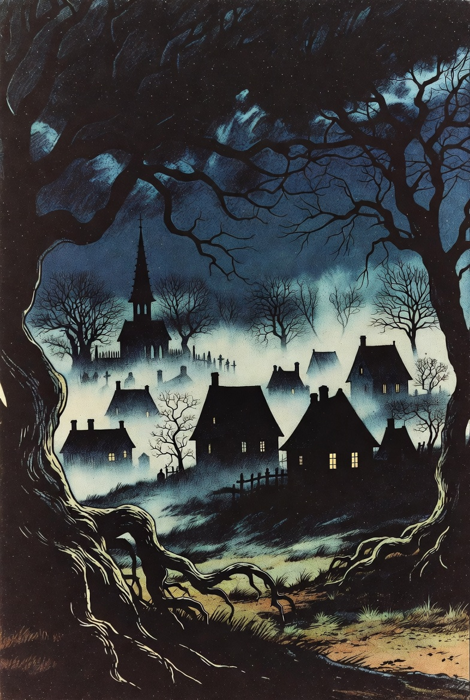

# Witch Hunt



> “The bell tolls over Eldermond. Fog crawls between the houses, whispers hide behind locked doors,  
> and by sunrise someone will burn.  
> Find the witch before fear turns the village against you.”

A dark, atmospheric text adventure written in pure Java.  
Features:
- 13 haunted locations
- Sanity / Faith / Suspicion system
- Cursed items & lying NPCs
- Multiple endings (including the True Witch ending)

### Current state

Currently playable core: movement, take/drop, inventory, status, fog-thick descriptions.

### How to run
```bash
javac *.java
java Main